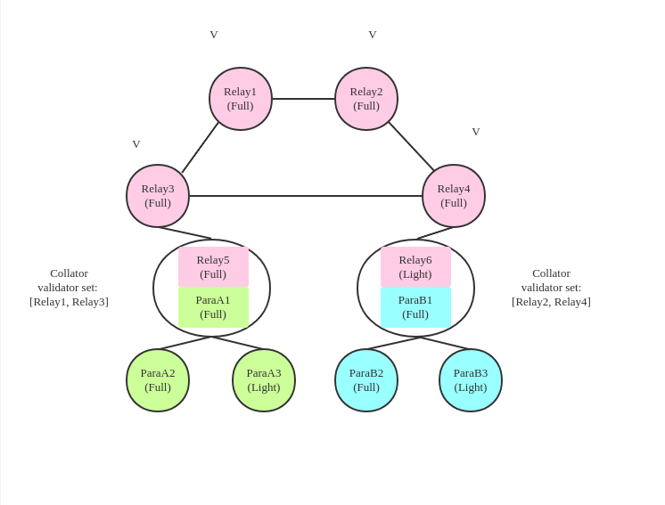
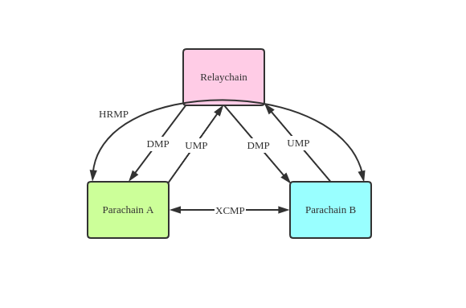
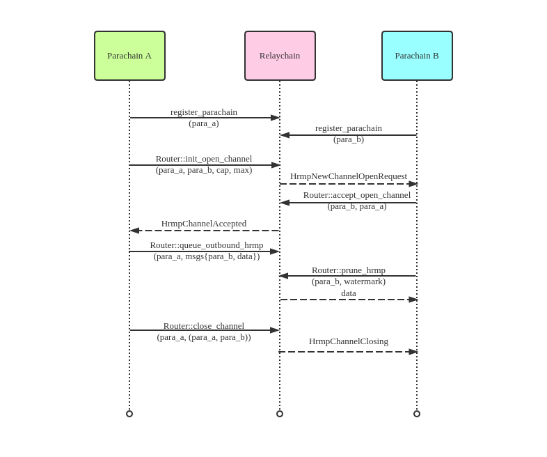
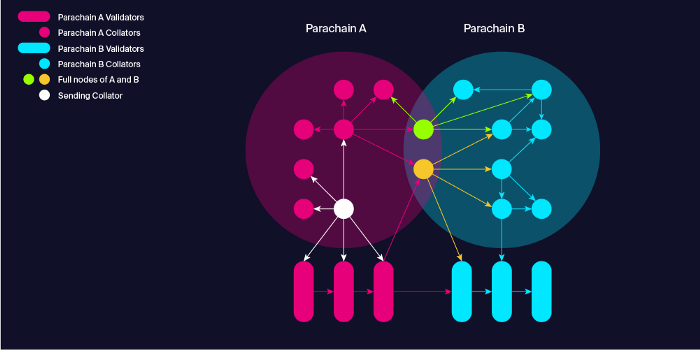
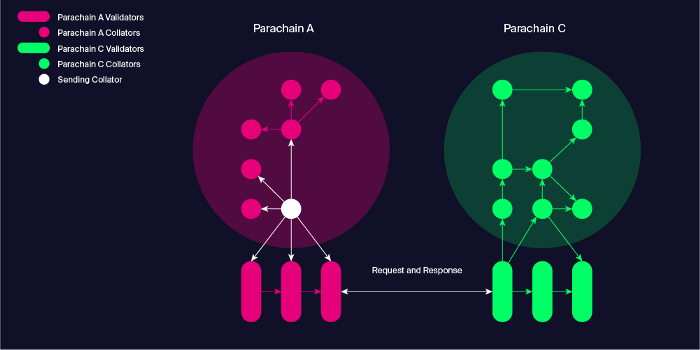

# 浅谈波卡平行链消息传递机制HRMP

### 摘要:
本文根据Polkadot github第1900号合并--`Implement HRMP`, 
先介绍了Polkadot 跨链相关的背景知识,HRMP相关的基本概念,分析了HRMP channel
通信的基本过程, 并与Polkadot跨链最终方案XCMP进行了对比分析.

### 背景:
Polkadot是一个Relaychain+Parachain 组合的多链系统.
Parachain的提出背景是为了解决区块链可扩展性(Scalability)和灵活性(Flexibility):
- (1)通过累加多个Parachain的TPS,提高整个多链系统的吞吐量.
- (2)针对不同的业务场景,Parachain可进行专门定制.

简单说, Parachain就是一个实现分片(Shard)的例子.

而Relaychain做为Polkadot多链系统的中枢, 则为Parachain提供了一致性安全保证及跨链消息路由机制.

那么Parachains之间如何进行跨链通信呢? 
HRMP(Horizontally Relay-routed Message Passing, 水平中继路由消息传递)便是其当前的解决方案.

### 一. Relaychain和Parachain拓扑边界

上图中: 1 Relaychain + Parachain A + Parachain B

- Relaychain: 4个Validator(Relay1,Relay2,Relay3,Relay4)
- Parachain A: 1个Collator + 1个Full node + 1个 Light node, 及2个 Validator(Relay1,Relay3)
- Parachain B: 1个Collator + 1个Full node + 1个 Light node, 及2个 Validator(Relay2,Relay4)

Collator是一类连接在每个Parachain和Relaychain之间的特殊节点, 即一部分连接Parachain,一部分连接Relaychain.
这样做至少有两个理由:
- (1) 通过它可以直接将Parachain block发送到Relaychain网络,从而被随机分配的Validator接收并验证. 
- (2) Collator做为Relaychain的Full或Light节点保持和Relaychain的同步,
能及时接收到新的Relaychain block通知,这个信息被用于Parachain的共识和出块机制.

### 二. HRMP相关概念

根据Web3基金会的术语表,和HRMP相关的概念如下:
- UMP: (Upward Message Passing) A vertical message passing mechanism from a Parachain to the relay chain.
- DMP: (Downward Message Passing). Message passing from the relay-chain to a Parachain.
- VMP: (Vertical Message Passing) A family of mechanisms that are responsible for message exchange between the relay chain and Parachains.
- HRMP: (Horizontally Relay-routed Message Passing). A mechanism for message passing between Parachains (hence horizontal) that leverages the relay-chain storage. Predates XCMP.
- XCMP (Cross-Chain Message Passing) A type of horizontal message passing (i.e. between Parachains) that allows secure message passing directly between Parachains and has minimal resource requirements from the relay chain, thus highly scalable.

总结一下:
- UMP是Parachain到Relaychain的消息传递.
- DMP是Relaychain到Parachain的消息传递.
- VMP = UMP + DMP
- HRMP是Parachain之间消息传递的过渡方案,它把跨链消息存在了Relaychain上,严重占用Relaychain的存储资源.
- XCMP是Parachain之间消息传递的终极方案, 允许Parachain之间直接传递信息且只占用Relaychain最小的资源.

### 三. HRMP Channel时序图
            

+ (1) Parachain A和 Parachain B都向 Relaychain提交注册.
+ (2) Parachain A向Relaychain发起建立到Parachain B的消息通道的请求(cap: 当前允许接收的最大消息数, max: 当前允许接收消息的最大字节数).
+ (3) Router::init_open_channel被调用的同时, Relaychain通过DMP机制向Parachain B 发送
HrmpNewChannelOpenRequest 消息.
+ (4) Parachain B 收到HrmpNewChannelOpenRequest 消息后, 向Relaychain回复接受建立(para_a, para_b)的消息通道的请求.
+ (5) Router::accept_open_channel被调用的同时, 通道被建立, Relaychain通过DMP机制向Parachain A 发送
HrmpChannelAccepted 消息.
+ (6) Parachain A收到HrmpChannelAccepted 消息后, 向Relaychain发送到Parachain B的消息data
+ (7) Router::queue_outbound_hrmp将Parachain A的消息出口队列data 转移到 Parachain B的消息入口队列
+ (8) Router::prune_hrmp从Parachain B的消息入口队列查询并返回消息data(watermark是Relaychain blocknumber, 表示小于这个高度的传入消息都已被处理)
+ (9) Parachain A向Relaychain 发起注销到Parachain B的消息通道的请求.
+ (10) Router::close_channel被调用的同时, Relaychain通过DMP机制向Parachain B发送
HrmpChannelClosing 消息.    
+ (11)  通道元数据被删除,

### 四. HRMP vs XCMP
我们对比一下Web3基金会定义的XCMP, 假定按照Gossip算法发送消息

(1) Parachain之间有相同节点

`图中显示了基于Gossip算法传递消息的情况,假定由最新产生ParaBlock的Parachain A网络中的Collator节点发起.`

跨链消息将直接从Parachain A 网络传递到Parachain B网络.
 
(2) Parachain之间没有相同节点

`图中显示了FallBack方式传递消息的情况,他们之间没有共同的全节点.`

我们假设Parachain A向Parachain C发送跨链消息. 
当Parachain C的Validator通知跨链消息没有被传递到Parachain C时, 
它们将会向Parachain A的Validator请求他们Parachain出口队列中的跨链消息, 
收到相应的回应后,再按照Gossip算法将跨链消息传递到Parachain C网络.

当跨链消息被加入到他们的消息出口队列时, 跨链消息被保存在他们平行链中的Collator节点和
Full节点上.当平行链的区块头被纳入中继链上时, 平行链的Validators 也会保存这些跨链消息.
为了保证跨链消息的可用性,要求所有的Validator保存跨链消息的纠删码,
纠删码由发送跨链消息的平行链中的valiadators 生成和分发.只要Validators 
至少保存了三分之二, 跨链消息就能复原.如果低于三分之二, Validators将会受到经济惩罚.
以此来保证跨链消息的可用性.

综上, XCMP机制中, Relaychain只保留了跨链消息的hash, 而跨链消息则以纠删码的方式保存在了
发送跨链消息的平行链中的Collator, FullNode和Validator上.

### 五. 总结

从语义上讲, HRMP模仿了XCMP的业务接口, 将跨链消息存储在Relaychain上使事情变得简单, 
同时对Relaychain资源要求较高,价格昂贵.

而XCMP比较灵活,扩展性高,但实现难度大,方案还在演进中.当XCMP实现后, HRMP自然会被遗弃.

##### 参考链接:

- [Polkadot’s Messaging Scheme](https://medium.com/web3foundation/polkadots-messaging-scheme-b1ec560908b7)
- [Parachain Implementation Guide](https://w3f.github.io/Parachain-implementers-guide/glossary.html)
- [Implement HRMP](https://github.com/paritytech/polkadot/pull/1900)
- [Research At Web3](https://research.web3.foundation/en/latest/polkadot/XCMP/index.html)
- [Cumulus Overview](https://github.com/paritytech/cumulus/blob/master/docs/overview.md)
